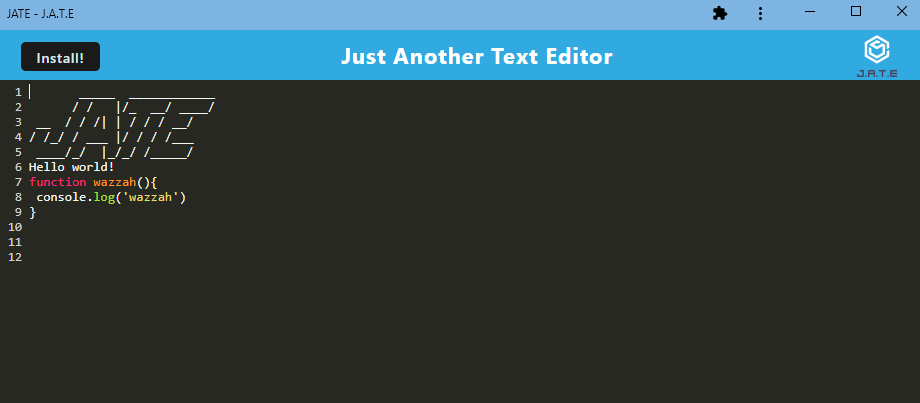

# JATE: Just Another Text Editor
 
  
 
  ## Table of Contents
  
  [Description](#description)

  [Installation](#installation)
  
  [Usage](#usage)

  [Contribute](#contribute)
  
  [Credits](#credits)
  
  [License](#license)

  [Questions](#questions)
  
  ## Description
  This is a progressive web application that functions as a text editor.

  ## Installation
  This application uses several npm packages in the package.json files, so an 'npm install' will be necessary.To build the dist folder for the pwa deployment, users will also need to use 'npm run build' at the root level of the application. They can then fireup both the client and the server at the same time with 'npm run start:dev".

  ## Usage
  Once installed, this is a text editor that saves what is being typed into it into an IndexedDB object store. In order to see the changes that have been saved to IndexedDB, users can hit the refresh button when viewing IndexedDB storage (in the screenshot below, the refresh button is the circular arrow under the Network tab). Users can click the install button to save the application to their desktop.

  [Heroku Deployed App: (https://gentle-garden-70252-13b1f28f1d89.herokuapp.com/)]

  IndexedDB Object Store:  

  

  Installed Application:

  
  
  ## Contribute

  [GitHub Repo: (https://github.com/AdamJohnson92/PWA-Text-Editor)]

  
  ## Credits
  Assistance with getting run build to work courtesy of BCS tutor Faran Navazi, and assistance with getting IndexedDb to function courtesy of BCS instructor Rebecca Goldstein. Other snippets of code  such as css and babel loaders, and WebPack plugins and get and put routes for IndexedDB came from inclass examples from BCS Fullstack Flex Bootcamp, unit 19.

  ## License
  
  
  
  This project uses packages that are licensed under the terms of the MIT license.

  ## Questions?

  Contact me at:

  GitHub: https://github.com/AdamJohnson92
  
  email: adamgjohnson92@gmail.com